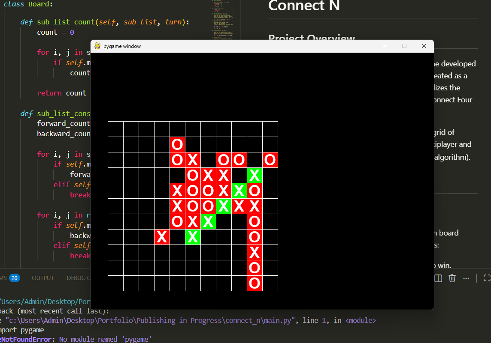

# Connect N

## Project Overview
"Connect N" is a customizable strategy board game developed using Python and the Pygame library. Originally created as a high school senior project, this application generalizes the mechanics of classic games like Tic-Tac-Toe and Connect Four into a scalable, grid-based experience.

The game allows players to compete on a square grid of variable size ($N \times N$), supporting both local multiplayer and single-player modes against a AI (Heuristic-based algorithm).


## Features

### Dynamic Gameplay Rules
The game logic adapts automatically to the chosen board dimension, scaling the difficulty and win conditions:
- **3x3 Board**: Requires **3** consecutive marks to win.
- **Standard Boards (4x4 to 7x7)**: Requires **4** consecutive marks to win.
- **Large Boards (>7x7)**: Requires **5** consecutive marks to win.

### Game Modes
- **Duo (PvP)**: Two players take turns placing marks ('x' and 'o') on the same machine.
- **AI Mode**: A single-player mode against a computer opponent. The AI utilizes heuristic logic to:
    - Detect and complete winning lines.
    - Block immediate threats from the player.
    - Strategically build sequences to force a win.

### Technical Highlights
- **Object-Oriented Design**: The `Board` class encapsulates the entire game state, including grid management, rendering, and rule enforcement.
- **Scalable Win Detection**: The system pre-calculates all valid winning sub-lists (rows, columns, and diagonals) based on the board dimension, allowing for efficient state checking during gameplay.
- **Interactive GUI**: Built with Pygame, featuring mouse-driven input, real-time score tracking, and visual highlights for winning combinations.
- **Heuristic AI Logic**: The computer opponent determines moves using a strict priority system:
    1.  **Secure Win**: Completes a winning line immediately if possible.
    2.  **Block**: Intercepts the player's line if they are one move away from winning.
    3.  **Prevent Traps**: Blocks lines where the player has `Win-2` marks with open ends (preventing an unblockable setup).
    4.  **Build**: Plays in lines where the AI has the most existing marks and the player has none.
    5.  **Random**: Selects a random valid box if no strategic moves are found.

## How to Run

### Prerequisites
- Python 3.x
- Pygame (`pip install pygame`)

### Execution
Run the main script to launch the game:
```bash
python main.py
```